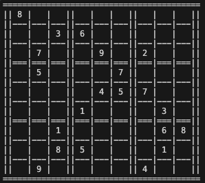
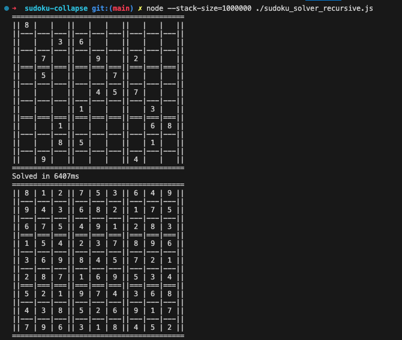

The code presented in this post is available on [github](https://github.com/obiSerra/sudoku-wave-solver). 

## Why
If you search on the internet for the world's hardest sudoku you will probably find many solutions to your search, like [this one](https://abcnews.go.com/blogs/headlines/2012/06/can-you-solve-the-hardest-ever-sudoku) or [this one](https://abcnews.go.com/blogs/headlines/2012/06/can-you-solve-the-hardest-ever-sudoku).


Leaving aside the clickbait title, my main interest was to play with the _wave function collapse algorithm_: a very interesting algorithm that is often used to generate procedural content in games (or to solve puzzles like sudoku).


For this post, I will consider this as the hardest sudoku (the one from [the first article](https://abcnews.go.com/blogs/headlines/2012/06/can-you-solve-the-hardest-ever-sudoku)):
<br />
<br />
<br />




## The wave function collapse algorithm

If you are looking for a clear explanation of what this algorithm is, you are probably on the wrong website, but in very short terms it is a function that given a single point (a tile in a map or a cell in sudoku) can return every possible value that point can assume, each with its probability; only when the function collapse, it returns the final value. Depending on the problem we want to solve we can model how the probability of each value change, for example in a map we can say that a tile is affected by the tiles around it, or in sudoku we can say that a cell is affected by the cells in the same row, column, and square.

## Solving simple sudoku

Applying this algorithm to simple sudoku is not very hard:
1. we first need some helper function to get the "allowed values" for each cell (the values that are not already present in the same row, column, and square)
2. for each cell, starting from those with less allowed values, we collapse the wave function and remove the value from the allowed values of the cells in the same row, column, and square
3. we then repeat the process until we have a solution


## Solving the hardest sudoku

The problem with harder puzzles is that we cannot be sure that the allowed values for a specific cell are valid results until we collapse every other cell: choosing the wrong value in a particular spot can make the rest of the puzzle unsolvable.

To avoid this problem we need to add a backtracking mechanism: if we find ourselves in an "invalid" state we need to go back to the previous state and try a different value.

### Recursive backtracking

A "simple" way to solve this problem is to use recursion (and so stack): we can recursively call the function for each cell, passing the current state of the puzzle, the list of invalid choices (that we compile as we find ourself in an invalid state) and list of cell processed so far (so we can backtrace).


So let's implement it in JavaScript:


*(note: this code may be out of date, please refer to [the github repo](https://github.com/obiSerra/sudoku-wave-solver/blob/main/src/index.js) for the latest version)*

```js
const solveWave = (board, invalid = {}, calls = []) => {
  const missing = board.missingNumbers();
  if (missing.length === 0) return board;

  const possibleValues = [];
  for (const miss of missing) {
    const values = listPossibleValues(board, miss);
    const cell = [miss, values.filter(a => !invalid[JSON.stringify(board.board) + `_${miss.join("-")}`]?.includes(a))];
    possibleValues.push(cell);
  }

  // sort the missing numbers by the number of possible values
  possibleValues.sort((a, b) => a[1].length - b[1].length);

  const possibility = possibleValues[0];
  const [cell, available] = possibility;

  if (available.length === 0) {
    if (calls.length === 0) {
      debugger;
    }
    const [lastCell, lastValue] = calls.pop();
    board.board[lastCell[0]][lastCell[1]] = null;
    const hash = JSON.stringify(board.board) + `_${lastCell.join("-")}`;
    invalid[hash] = invalid[hash] || [];
    invalid[hash].push(lastValue);

    return solveWave(board, invalid, calls);
  }

  // Select a random value from the available values
  const value = sample(available);
  board.board[cell[0]][cell[1]] = value;
  calls.push([cell, value]);

  return solveWave(board, invalid, calls);
};
```

A big problem with this solution is that depending on the complexity of the puzzle we can end up exceeding the maximum call stack size (both in `Node.js` and the browser). We can still solve the "hardest sudoku" by cheating and increasing the maximum call stack size running: 
<br />
 `$ node --stack-size=1000000 sudoku_solver.js`


<br />
<br />

__NOTE: Since this algorithm tries to solve the puzzle by collapsing the function with random values, the time of completion may vary: if you are very lucky it can be solved in less than a second__

### We are better than this

Forcing the maximum call stack size is not a very elegant solution, so let's try to improve our algorithm.

We simply need to implement a stack iteratively, to avoid recursion. We can do this by using a `while` (a `do while` in this example) loop and a `stack` array:

*(note: this code may be out of date, please refer to [the github repo](https://github.com/obiSerra/sudoku-wave-solver/blob/main/src/index.js) for the latest version)*

```js
const solveWaveIterative = board => {
  const stack = [board.board];
  const invalid = {};
  const calls = [];

  do {
    const boardConfig = stack.pop();
    board.board = boardConfig;
    const missing = board.missingNumbers();
    if (missing.length === 0) {
      return board;
    }

    const possibleValues = [];
    for (const miss of missing) {
      const values = listPossibleValues(board, miss);
      const cell = [
        miss,
        values.filter(a => !invalid[JSON.stringify(board.board) + `_${miss.join("-")}`]?.includes(a)),
      ];
      possibleValues.push(cell);
    }

    // sort the missing numbers by the number of possible values
    possibleValues.sort((a, b) => a[1].length - b[1].length);

    const possibility = possibleValues[0];
    const [cell, available] = possibility;

    if (available.length === 0) {
      const [lastCell, lastValue] = calls.pop();
      board.board[lastCell[0]][lastCell[1]] = null;
      const hash = JSON.stringify(board.board) + `_${lastCell.join("-")}`;
      invalid[hash] = invalid[hash] || [];
      invalid[hash].push(lastValue);

      stack.push(board.board);
    } else {
      // Select a random value from the available values
      const value = sample(available);
      board.board[cell[0]][cell[1]] = value;
      calls.push([cell, value]);
      stack.push(board.board);
    }
  } while (stack.length > 0);

  return board;
};
```

Now we can run the algorithm without fear of blowing up the stack:

`$ node ./sudoku_solver.js`


<br />
<br />

__NOTE: Since this algorithm tries to solve the puzzle by collapsing the function with random values, the time of completion may vary: if you are very lucky it can be solved in less than a second__


## Performance

I run the iterative version on the "hardest sudoku" 100 times and I got the following results:

| Stat | Time (rounded)|
| :--- | :--- |
| Max | 12955 ms|  
| Min |	261 ms |  
| Average |	5188 ms|
| Standard Deviation |	3165 ms|
